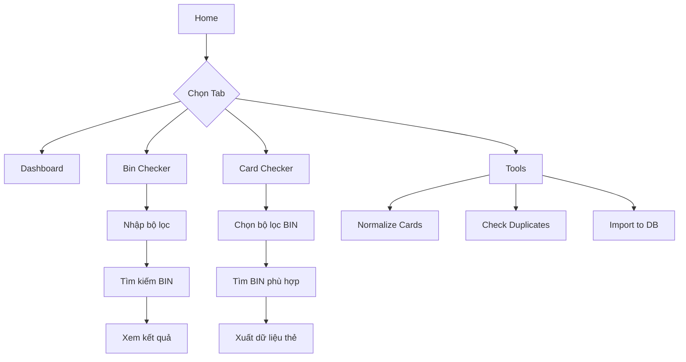

## 1. Tổng quan sản phẩm

Hệ thống BIN Database System là một ứng dụng Cloudflare Workers cung cấp các công cụ kiểm tra và quản lý thẻ tín dụng. Hệ thống bao gồm 4 module chính: Dashboard, Bin Checker, Card Checker, và Tools.

Mục tiêu: Cung cấp nền tảng toàn diện để tra cứu thông tin BIN, xuất dữ liệu thẻ, và quản lý cơ sở dữ liệu thẻ với hiệu suất cao và giao diện thân thiện.

## 2. Tính năng cốt lõi

### 2.1 Vai trò người dùng
| Vai trò | Phương thức đăng ký | Quyền hạn cốt lõi |
|---------|---------------------|-------------------|
| Người dùng thường | Truy cập trực tiếp | Sử dụng tất cả tính năng tra cứu |

### 2.2 Module chức năng
Hệ thống bao gồm các trang chính sau:
1. **Dashboard**: Thống kê tổng quan về số lượng BIN, thẻ, phân bố theo brand, country, type, category.
2. **Bin Checker**: Tra cứu thông tin BIN theo các bộ lọc (brand, type, category, country, issuer) với phân trang.
3. **Card Checker**: Xuất dữ liệu thẻ từ BIN đã chọn với các bộ lọc trạng thái và giới hạn số lượng.
4. **Tools**: Các công cụ xử lý thẻ gồm Normalize, Check Duplicates, và Import to Database.

### 2.3 Chi tiết trang
| Tên trang | Module chính | Mô tả chức năng |
|-----------|-------------|-----------------|
| Dashboard | Thống kê tổng quan | Hiển thị tổng số BIN, tổng số thẻ, số thẻ live/die, top 10 BIN có nhiều thẻ nhất, thống kê theo brand/country/type/category |
| Bin Checker | Bộ lọc tìm kiếm | Cho phép tìm kiếm BIN theo: BIN numbers, brand, type, category, country, issuer với giới hạn kết quả từ 1-1000 |
| Bin Checker | Kết quả tìm kiếm | Bảng hiển thị BIN, Brand, Type, Category, Issuer, Country với phân trang và copy danh sách BIN |
| Card Checker | Bộ lọc BIN | Tìm kiếm BIN theo brand, type, category, country, issuer với điều kiện số thẻ tối thiểu |
| Card Checker | Bộ lọc trạng thái | Chọn xuất thẻ theo trạng thái: Unknown, Live (1), CT (2), Die (0) |
| Card Checker | Xuất dữ liệu | Xuất thẻ với số lượng tối đa 100 thẻ/BIN, định dạng plain text hoặc full info |
| Tools - Normalize | Chuẩn hóa thẻ | Chuyển đổi nhiều định dạng thẻ về chuẩn pan|mm|yy|cvv, kiểm tra hết hạn |
| Tools - Check Duplicates | Kiểm tra trùng lặp | So sánh PAN với database để tìm thẻ đã tồn tại |
| Tools - Import | Nhập dữ liệu | Thêm thẻ mới vào database cdata với cập nhật thống kê tự động |

## 3. Luồng hoạt động chính

### Luồng người dùng chính:

**Dashboard Flow:**
1. Người dùng truy cập trang chính → hệ thống hiển thị dashboard với thống kê tổng quan
2. Có thể click Refresh để cập nhật dữ liệu mới nhất

**Bin Checker Flow:**
1. Chuyển đến tab Bin Checker → nhập các bộ lọc tìm kiếm
2. Click "Bin Checker" để thực hiện tìm kiếm
3. Duyệt kết quả với phân trang, copy danh sách BIN nếu cần

**Card Checker Flow:**
1. Chuyển đến tab Card Checker → chọn bộ lọc BIN và trạng thái thẻ
2. Click "Search BINs" để tìm BIN phù hợp
3. Click "Export All" để xuất dữ liệu thẻ theo cấu hình
4. Download hoặc copy kết quả xuất

**Tools Flow:**
1. **Normalize**: Dán thẻ → click Normalize → copy kết quả chuẩn hóa
2. **Check Duplicates**: Dán thẻ → click Check → xem thẻ unique/duplicate
3. **Import**: Dán thẻ → click Import → xác nhận để thêm vào database

## 4. Thiết kế giao diện người dùng

### 4.1 Phong cách thiết kế
- **Màu chính**: Xanh dương (#3b82f6) - đồng bộ với hệ thống hiện có
- **Màu phụ**: Xám nhạt (#f3f4f6) cho background
- **Kiểu nút**: Rounded corners, shadow nhẹ
- **Font chữ**: Inter, kích thước 14px cho nội dung chính
- **Layout**: Card-based với glass morphism effect
- **Biểu tượng**: Emoji đơn giản, dễ hiểu

### 4.2 Tổng quan thiết kế trang
| Tên trang | Module chính | Thành phần UI |
|-----------|-------------|---------------|
| Dashboard | Thống kê | 4 card tổng quan, 4 bảng top 10 (brands, countries, types, categories), glass morphism design |
| Bin Checker | Form tìm kiếm | Textarea BIN (600x120px), 6 input bộ lọc, limit selector (1-1000), nút Search/Clear |
| Bin Checker | Kết quả | Data table 6 cột với phân trang, nút copy BIN list, loading skeleton |
| Card Checker | Tìm BIN | 5 select bộ lọc, min cards input, max BINs input (1-100000), status checkboxes |
| Card Checker | Xuất thẻ | Cards per BIN input (1-100), export format radio, progress bar, export result textarea |
| Tools - Normalize | Input/Output | Textarea input (500x150px), checkbox filter expired, output textarea, error section |
| Tools - Duplicates | Check tool | Input textarea, file upload support, progress bar, dual output areas |
| Tools - Import | Import tool | Input textarea, file upload, batch progress, import statistics, error log |

### 4.3 Responsive design
- Desktop-first approach
- Responsive cho tablet (768px) và mobile (480px)
- Textarea và bảng kết quả co giãn theo màn hình
- Giữ lại tất cả chức năng trên mobile

## 5. Yêu cầu kỹ thuật

### 5.1 Giới hạn hệ thống
- **Bin Checker**: Tối đa 1000 BIN mỗi lần tra cứu
- **Card Checker**: Tối đa 100,000 BINs, 100 cards/BIN, batch size 10 BINs
- **Tools Import**: Tối đa 100,000 cards mỗi lần
- **Tools Duplicates**: Tối đa 100,000 cards mỗi lần
- **Cache TTL**: Dashboard 1h, Stats 6h, Filters 6h, Search 5m, Card stats 5m, BIN detail 30m
- **Database**: D1 SQLite với giới hạn 100 parameters/query

### 5.2 Xử lý lỗi
- Validate BIN format (6 chữ số)
- Hiển thị thông báo lỗi khi nhập BIN không hợp lệ
- Xử lý graceful degradation khi database timeout
- Retry mechanism cho transient errors