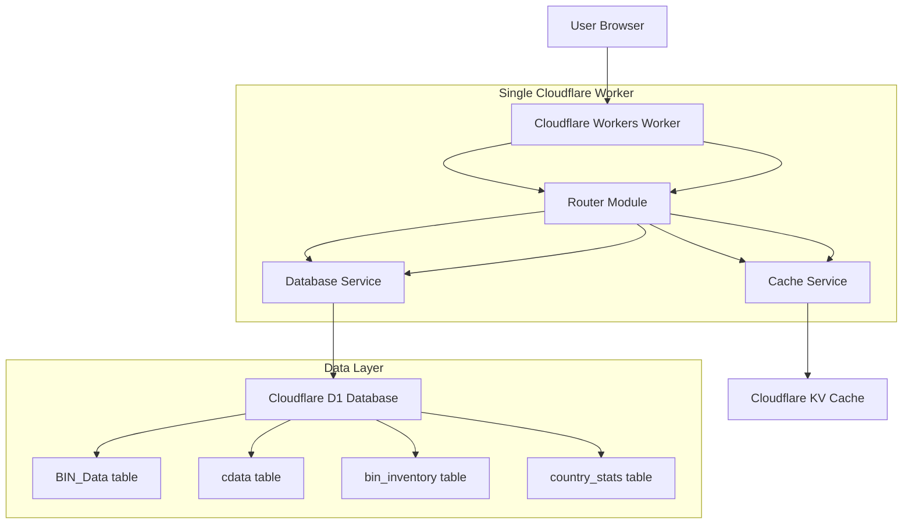
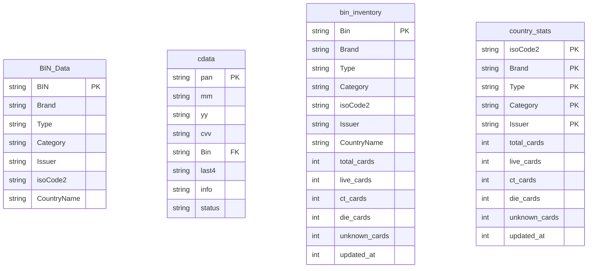

## 1. Thiết kế kiến trúc



## 2. Mô tả công nghệ

- **Platform**: Cloudflare Workers (Serverless JavaScript)
- **Database**: Cloudflare D1 (SQLite compatible)
- **Cache**: Cloudflare KV (Key-Value storage)
- **Frontend**: Vanilla HTML/CSS/JS embedded trong Worker
- **Styling**: Tailwind CSS CDN + custom glass morphism
- **Icons**: Font Awesome 6.5.1
- **Deployment**: Wrangler CLI hoặc Cloudflare Dashboard

## 3. Định nghĩa routes

| Route | Method | Mục đích |
|-------|--------|----------|
| GET / | Serve HTML interface | Giao diện chính |
| GET /api/bin | Query | Tìm kiếm BIN theo bộ lọc |
| GET /api/bin/{bin} | Query | Lấy thông tin chi tiết BIN |
| GET /api/stats | Query | Thống kê BIN_Data |
| GET /api/dashboard | Query | Thống kê tổng quan từ bin_inventory |
| GET /api/filters | Query | Lấy danh sách bộ lọc |
| GET /api/card-stats | Query | Thống kê thẻ từ bin_inventory |
| POST /api/search-bins | Action | Tìm BINs theo điều kiện cho export |
| POST /api/export-cards | Action | Xuất dữ liệu thẻ từ BINs |
| POST /api/normalize | Tool | Chuẩn hóa định dạng thẻ |
| POST /api/check-duplicates | Tool | Kiểm tra thẻ trùng lặp |
| POST /api/import | Action | Import thẻ vào database |
| POST /api/admin/rebuild-stats | Admin | Rebuild statistics tables |
| GET /api/bin/export | Export | Export BIN data as CSV/JSON

## 4. API definitions

### 4.1 Core APIs

**Search BINs API:**
```
GET /api/bin?bin=453212,541234&brand=VISA&type=CREDIT&limit=50&offset=0
```

**Search Bins for Export:**
```
POST /api/search-bins
{
  "brand": "VISA",
  "type": "CREDIT", 
  "category": "CLASSIC",
  "country": "US",
  "issuer": "CHASE",
  "minCards": 10,
  "maxBins": 10000,
  "status": ["unknown", "1", "2"]
}
```

**Export Cards API:**
```
POST /api/export-cards
{
  "bins": ["453212", "541234"],
  "cardsPerBin": 50,
  "status": ["unknown", "1", "2"], 
  "includeInfo": false
}
```

**Import Cards API:**
```
POST /api/import
{
  "cards": [
    "4532123456789012|12|25|123",
    "5412345678901234|06|24|456"
  ]
}
```

**Normalize Cards API:**
```
POST /api/normalize
{
  "cards": ["4532123456789012/12/25/123"],
  "filterExpired": true
}
```

## 5. Cấu trúc module

```
src/
├── modules/
│   ├── card-checker/
│   │   ├── card-checker.module.js
│   │   ├── card-checker.service.js
│   │   └── card-checker.controller.js
│   ├── database/
│   │   ├── database.service.js
│   │   └── queries/
│   │       └── bin-queries.js
│   └── cache/
│       └── cache.service.js
├── routes/
│   └── api.routes.js
├── utils/
│   ├── validators.js
│   └── formatters.js
└── index.js
```

## 6. Mô hình dữ liệu

### 6.1 Database Schema



### 6.2 Query Strategy

**BIN Checker Queries BIN_Data:**
```sql
-- Tìm BIN theo nhiều điều kiện
SELECT BIN, Brand, Type, Category, Issuer, isoCode2
FROM BIN_Data
WHERE BIN IN (?) AND Brand = ? AND Type = ?
ORDER BY BIN ASC
LIMIT ? OFFSET ?
```

**Dashboard/Card Queries bin_inventory:**
```sql
-- Thống kê tổng quan
SELECT SUM(total_cards) as totalCards, COUNT(*) as uniqueBins 
FROM bin_inventory

-- Tìm BINs cho export
SELECT Bin, Brand, Type, Category, isoCode2, Issuer, total_cards, live_cards
FROM bin_inventory
WHERE Brand = ? AND total_cards >= ? AND (live_cards > 0 OR unknown_cards > 0)
ORDER BY total_cards DESC
LIMIT ?
```

**Card Export Queries cdata:**
```sql
-- Xuất thẻ theo BIN và status
SELECT pan, mm, yy, cvv, Bin, info
FROM cdata 
WHERE Bin IN (?) AND status IN (?, ?, ?)
ORDER BY RANDOM()
LIMIT ?
```

**Indexes:**
- `idx_cdata_bin_status` on cdata(Bin, status)
- `idx_cdata_pan` on cdata(pan)  
- `idx_bindata_brand_type_cat_country` on BIN_Data(Brand, Type, Category, isoCode2)
- `idx_bininv_country_brand` on bin_inventory(isoCode2, Brand)

## 7. Xử lý cache

### 7.1 Cache Strategy
- **Dashboard**: 1 giờ (3600s)
- **Statistics**: 6 giờ (21600s) 
- **Filters**: 6 giờ (21600s)
- **Search Results**: 5 phút (300s)
- **BIN Detail**: 30 phút (1800s)
- **Card Stats**: 5 phút (300s)

Key format: `${prefix}:${sorted_params_hash}`
Cache service tự động clear cache khi có import mới

### 7.2 Cache implementation
```javascript
const cacheKey = `bin_checker:${hashBins(bins)}`;
const cached = await cache.get(cacheKey);
if (cached) return JSON.parse(cached);

// Process and cache result
await cache.put(cacheKey, JSON.stringify(result), { expirationTtl: 300 });
```

## 8. Xử lý lỗi và validation

### 8.1 Input Validation

**BIN Validation:**
- BIN phải là 6 chữ số
- Validate format và loại bỏ khoảng trắng
- Giới hạn 1000 BIN mỗi query

**Card Validation (Luhn + Format):**
```javascript
// PAN: 15-19 digits, Luhn check
// MM: 01-12, YY: 2-4 digits  
// CVV: 3-4 digits
// Format support: | / , space
```

**Import Limits:**
- Max 100,000 cards per import
- Batch size 12 cards (96 parameters)
- Check duplicates với temp table strategy
- Update statistics cho affected BINs only

### 8.2 Error handling
```javascript
try {
  const results = await processBins(validatedBins);
  return { success: true, results };
} catch (error) {
  return { 
    success: false, 
    error: error.message,
    code: error.code || 'UNKNOWN_ERROR'
  };
}
```

## 9. Deployment với Wrangler

### 9.1 Worker Configuration

**Wrangler Configuration:**
```toml
name = "cdemo"
main = "src/index.js"
compatibility_date = "2024-01-01"

[[d1_databases]]
binding = "DB"
database_name = "bin_database" 
database_id = "your-database-id"

[[kv_namespaces]]
binding = "CACHE"
id = "your-kv-namespace-id"

[env.production.vars]
ADMIN_TOKEN = "your-admin-token"
```

**Environment Variables:**
- `ADMIN_TOKEN`: Token cho rebuild stats API

### 9.2 Deploy command
```bash
wrangler deploy
```

## 10. Performance optimization

### 10.1 Performance Optimizations

**Batch Processing:**
- Card export: 10 BINs per batch
- Import: 12 cards per INSERT (96 params)
- Duplicate check: 1000 cards per batch
- Auto-retry với exponential backoff

**Database Optimization:**
- Multi-value INSERT để giảm round trips
- Batch update statistics sau import
- Prepared statements với parameter binding
- Composite indexes cho complex queries

**Memory Management:**
- Streaming cho large exports
- Chunked processing (1000 items max)
- Progressive progress updates
- Automatic cleanup sau operations

**Caching Strategy:**
- Smart cache invalidation
- Hierarchical cache keys
- Background cache refresh
- TTL-based expiration